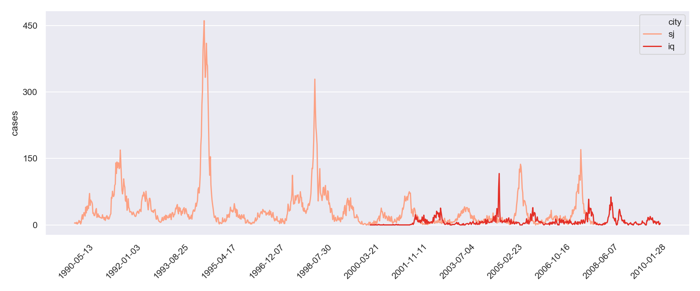
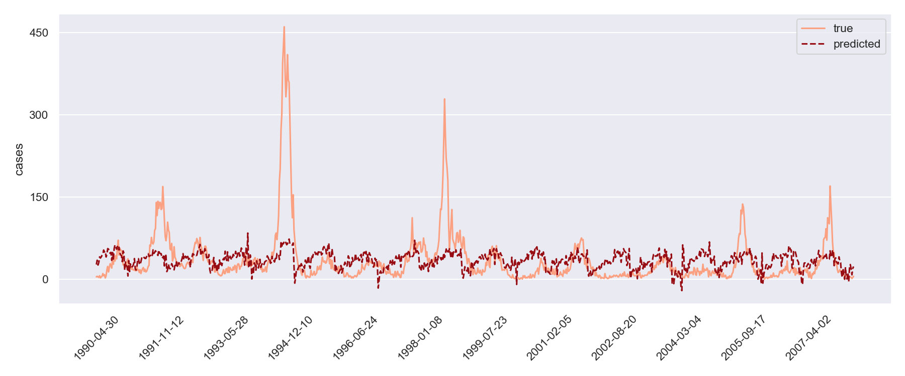

Thoughts on the mistakes I made along the way. For a more in-depth look at
my team's work in this competition, see [github](https://github.com/datascienceslugs/dss-diseasespread).
{: .text-justify}

## Problem description

This competition is hosted on 
[Driven Data](https://www.drivendata.org/competitions/44/dengai-predicting-disease-spread/). 
We are given weekly climactic data such a precipitation and temperature spread for two cities, 
San Juan (Puerto Rico) and Iquitos (Peru), as well as the number of dengue fever cases. 
The goal is to predict the number cases for each city several weeks into the future.
Future climactic data is also given, a reasonably realistic setup since reliable short-term
climactic forecasts are readily available. Predictions are scored by mean absolute error (MAE).
{: .text-justify}

### Data

The outbreaks have a clear seasonal pattern, though that is not the entire story as
 the size of the peak varies wildly year on year. The difficulty of the problem is  
thus to capture both the seasonal structure (relatively easy) and the exponential 
 growth during the major outbreak years
(much harder).

***Figure 1**: historical outbreak data*
{: .text-center}

{: .text-justify}

In fact, learning the seasonal structure seems to be in reach of even an OLS model
on the base features. This is because many of the climactic features themselves
have a seasonal pattern.

***Figure 2**: true and predicted values for San Juan using OLS*
{: .text-center}

Therefore, our efforts should be directed to finding a way to model the time 
autocorrelation of cases.

## Lessons from attempted approaches

### Informative features > expressive functional forms

This is obvious to anyone with more skill than me, but "growing up" on Kaggle kernels stacked 
XGBoosts I internalized the notion that throwing gradient boosting and hyperparameter optimization 
at almost any structured data problem yields an acceptable first model.
{: .text-justify}

Using this first appraoach resulted a MAE of 28.488, quite a bit worse than the organizers' negative 
binomial regression [benchmark](https://www.drivendata.co/blog/dengue-benchmark/). 
Another attempty using a simple linear model (linear regression with an $$L2$$ penalty) turned up
 similar scores. The extra expressivity of XGBoost did not seem to be doing much for us here. 
{: .text-justify}

Previous research showed that climactic data up to seven weeks in the past, in particular humidity 
and precipitation, is linked to outbreaks in dengue symptoms [1] (mosquito eggs become adults 
capable of transmitting the disease 10-45 days after being laid in favorable conditions).
Thus the next model used climactic data seven weeks in the past. Using again a linear regression
, this time with an $$L1$$ penalty to compensate for the the increased number of features, yields
an MAE of 25.735, enough to beat the benchmark and break into the top 1000.
{: .text-justify}

### Avoid treating models as a black box

Before getting the idea of using time lagged features, I found some discussions suggesting that Facebook's Prophet forecasting  model would give good results on this problem.
The model, assuming multiplicative seasonality and additonal regressors $$x(t)$$ is given by
{: .text-justify}

$$y(t) = g(t) \cdot s(t) \cdot \beta x(t) + h(t) + \varepsilon$$ 

[2] Where $$g(t)$$ is the trend component and $$s(t)$$ the seasonal component. The holiday 
component $$h(t)$$ was set to 0 as there didn't seem to be any such effect in the historical data.
{: .text-justify}

**Reference**

[2] Taylor SJ, Letham B. 2017. Forecasting at scale. *PeerJ Preprints* 5:e3190v2 [https://doi.org/10.7287/peerj.preprints.3190v2](https://doi.org/10.7287/peerj.preprints.3190v2)

